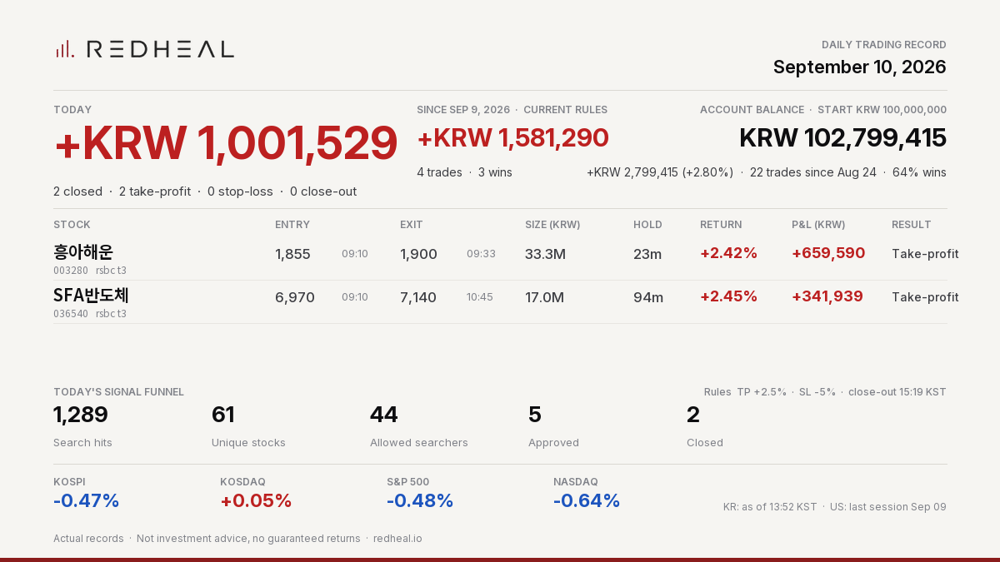

<p align="center">
  <picture>
    <source media="(prefers-color-scheme: dark)" srcset="assets/redheal_logo_white.png">
    
  </picture>
</p>

# REDHEAL COMPANY

A Korean fintech company providing algorithmic trading solutions for stocks and digital assets since 2018.
We are building a utility-first Web3 investment ecosystem where proven trading tools are accessed through a REDH token membership.

<!-- DAILY_RECORD:START -->
## Latest Daily Record — Korea 2026-09-10

<p align="center"></p>

```text
REDHEAL Auto-Trading | Sep 10, 2026
Today +KRW 1,001,529 | 2 closed (TP 2/SL 0/EOD 0)
흥아해운 +KRW 659,590 (+2.42%) TP
SFA반도체 +KRW 341,939 (+2.45%) TP
Since Sep 9 (current rules) +KRW 1,581,290
Balance KRW 102,799,415 (+2.80% since Aug 24)
Not investment advice.
```

[View on X](https://x.com/RedhealOfficial/status/2097909498472268219) · [All records](records/)
<!-- DAILY_RECORD:END -->

Every trading day we publish the actual results of our auto-trading system — the same post that goes to [X (@RedhealOfficial)](https://x.com/RedhealOfficial). All records are archived in [`records/`](records/). Actual records, not backtests. Not investment advice, no guaranteed returns.

## Four Services

| Service | What it does |
|---|---|
| Smart Scanner | AI-based real-time detection of surging stocks (order flow and pattern filters) |
| Stock Auto-Trading | Algorithmic auto-trading engine for Korean and US equities |
| Crypto Futures Quant | Volatility-breakout and trend-following strategy bots |
| Expert Insight | Market commentary and daily reports |

## REDH Token

| Item | Value |
|---|---|
| Name / Symbol | Redheal / **REDH** |
| Standard / Chain | ERC-20 (ERC20Burnable) / Polygon (PoS) |
| Contract | `0x226a6e9e1c5815b3037b461d7e53aa952c06f518` |
| Total Supply | 1,500,000,000 REDH (fixed, no additional issuance) |
| Security Audit | Verichains (2025-05-09) — [Redheal repo](https://github.com/redhealcompany/Redheal) |
| Legal Opinion | Changcheon Law Firm (2025-05-12) — [Redheal repo](https://github.com/redhealcompany/Redheal) |

REDH is a utility token for accessing services. It carries no profit-sharing or dividend rights. Users are solely responsible for their investment decisions.

## Official Links

- White Paper: https://redheal.gitbook.io/whitepaper
- Website: https://redheal.io · Wallet: https://redheal.io/wallet/
- Token Repository: https://github.com/redhealcompany/Redheal
- Telegram: https://t.me/redheal_official_chat · X: https://x.com/RedhealOfficial
- Contact: redhealcompany@gmail.com
