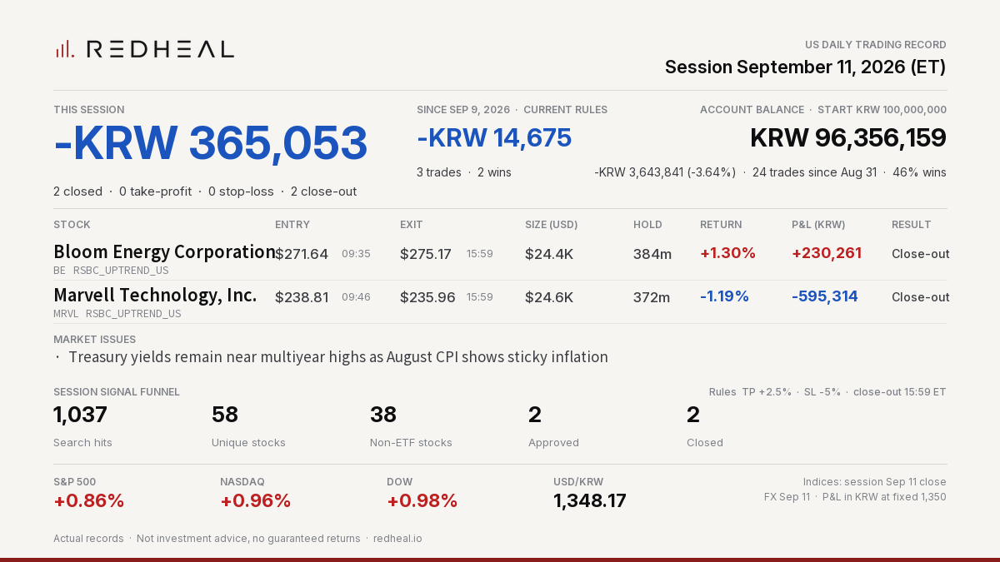
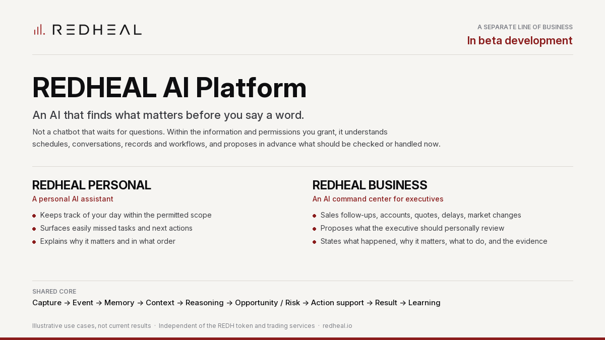

<p align="center">
  <picture>
    <source media="(prefers-color-scheme: dark)" srcset="assets/redheal_logo_white.png">
    
  </picture>
</p>

# REDHEAL COMPANY

REDHEAL COMPANY pursues two lines of business: the **investment automation** business we have built since 2018, and an **assistant-type AI platform** for individuals and companies that is now under development. The two are run as separate businesses with separate services.

| Line of business | What it is | Status |
|---|---|---|
| Investment Automation (TRADING) | Stock algorithmic auto-trading (Korea first, extending to the US), crypto futures quant, surge-stock screener, real-time signals, insight & reports. Connected to the REDH membership. | Building and validating on real records |
| REDHEAL AI Platform | Assistant-type AI for individuals (REDHEAL PERSONAL) and executives (REDHEAL BUSINESS). Independent of the REDH token and of the trading services. | Beta development |

<!-- DAILY_RECORD:START -->
## Latest Daily Record — US session 2026-09-11

<p align="center"></p>

```text
REDHEAL Auto-Trading US | Session Sep 11, 2026
Session -KRW 365,053 | 2 closed (TP 0/SL 0/EOD 2)
Bloom Energy Corporation BE +KRW 230,261 (+1.30%) EOD
Marvell Technology, Inc. MRVL -KRW 595,314 (-1.19%) EOD
Since Sep 9 (current rules) -KRW 14,675
Not investment advice.
```

[View on X](https://x.com/RedhealOfficial/status/2098524510899315194) · [All records](records/)
<!-- DAILY_RECORD:END -->

Every trading day we publish the actual results of our auto-trading system — the same post that goes to [X (@RedhealOfficial)](https://x.com/RedhealOfficial) and our Telegram channel [Redheal Official Chat](https://t.me/redheal_official_chat) and [Discord](https://discord.gg/8XzM9P5Jz), where the morning market briefing and real-time entry/exit signals are also posted. All records are archived in [`records/`](records/). Actual records, not backtests. Not investment advice, no guaranteed returns.

## Investment Automation — Four Services

| Service | What it does |
|---|---|
| Smart Scanner | AI-based real-time detection of surging stocks (order flow and pattern filters) |
| Stock Auto-Trading | Algorithmic auto-trading engine for Korean and US equities |
| Crypto Futures Quant | Volatility-breakout and trend-following strategy bots |
| Expert Insight | Market commentary and daily reports |

## REDHEAL AI Platform (beta development)

<p align="center"></p>

An AI that finds what matters before you say a word. Not a chatbot that answers only when asked: within the information and permissions the user has granted, it aims to understand schedules, conversations, records, and workflows, learn over time what matters, and propose in advance what should be checked or handled now. Every proposal is meant to state what happened, why it matters, what to do now, and what the judgment is based on.

- **REDHEAL PERSONAL** — a personal AI assistant that, within the permitted scope, keeps track of a person's day and surfaces easily missed tasks and next actions.
- **REDHEAL BUSINESS** — a management-support AI command center that brings together sales, accounts, quotes, work progress, and external changes, and proposes the opportunities and risks an executive should personally review. It does not make decisions on the executive's behalf.

Shared core: capture → event recognition → memory → context → reasoning → opportunity/risk detection → action proposal or execution support → result verification → learning. Voice-first, permission-scoped, with verifiable records. Unverified content is never stated as fact.

**Status**: in beta development; limited validation planned with a first enterprise customer. Use cases above are illustrative, not current results. The AI Platform is a business separate from the REDH token and the investment automation services. Full description: https://redheal.io/#aiplatform · [Announcement on X](https://x.com/RedhealOfficial/status/2097946948926165454)

## REDH Token

| Item | Value |
|---|---|
| Name / Symbol | Redheal / **REDH** |
| Standard / Chain | ERC-20 (ERC20Burnable) / Polygon (PoS) |
| Contract | `0x226a6e9e1c5815b3037b461d7e53aa952c06f518` |
| Total Supply | 1,500,000,000 REDH (fixed, no additional issuance) |
| Security Audit | Verichains (2025-05-09) — [Redheal repo](https://github.com/redhealcompany/Redheal) |
| Legal Opinion | Changcheon Law Firm (2025-05-12) — [Redheal repo](https://github.com/redhealcompany/Redheal) |

REDH is a utility token for accessing services. It carries no profit-sharing or dividend rights. Users are solely responsible for their investment decisions.

## Official Links

- White Paper: https://redheal.gitbook.io/whitepaper
- Website: https://redheal.io · Wallet: https://redheal.io/wallet/
- Token Repository: https://github.com/redhealcompany/Redheal
- Telegram (daily records, morning briefing, live signals): https://t.me/redheal_official_chat
- X: https://x.com/RedhealOfficial
- Discord (daily records, briefing, live signals): https://discord.gg/8XzM9P5Jz
- Contact: redhealcompany@gmail.com
