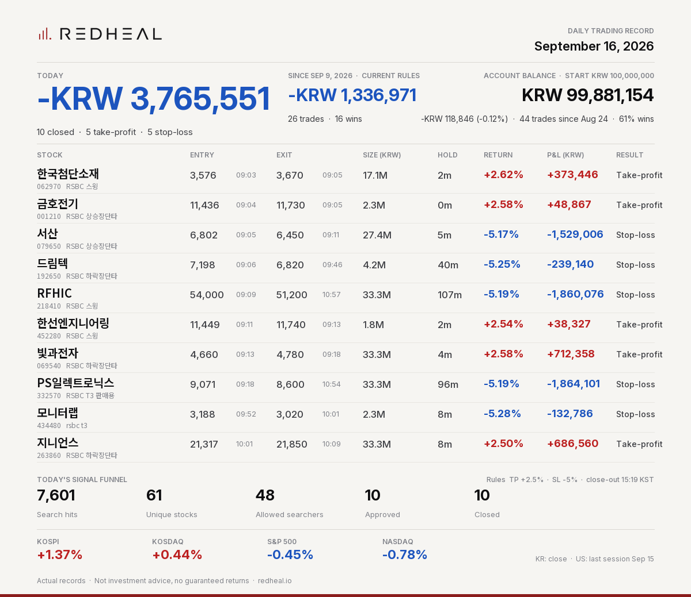

# REDHEAL Auto-Trading — Korea 2026-09-16



```text
REDHEAL Auto-Trading | Sep 16, 2026
Today -KRW 3,765,551 | 10 closed (TP 5/SL 5/EOD 0)
한국첨단소재 +KRW 373,446 (+2.62%) TP
금호전기 +KRW 48,867 (+2.58%) TP
서산 -KRW 1,529,006 (-5.17%) SL
드림텍 -KRW 239,140 (-5.25%) SL
+6 more (see image)
Not investment advice.
```

Posted on X: https://x.com/RedhealOfficial/status/2100123793935257774

Actual records. Not investment advice, no guaranteed returns. https://redheal.io
