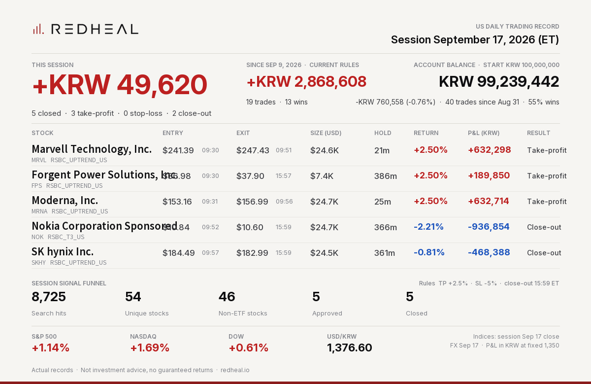

# REDHEAL Auto-Trading — US session 2026-09-17



```text
REDHEAL Auto-Trading US | Session Sep 17, 2026
Session +KRW 49,620 | 5 closed (TP 3/SL 0/EOD 2)
Marvell Technology, Inc. MRVL +KRW 632,298 (+2.50%) TP
Forgent Power Solutions, Inc. FPS +KRW 189,850 (+2.50%) TP
Moderna, Inc. MRNA +KRW 632,714 (+2.50%) TP
Not investment advice.
```

Posted on X: https://x.com/RedhealOfficial/status/2100698846049468645

Actual records. Not investment advice, no guaranteed returns. https://redheal.io
