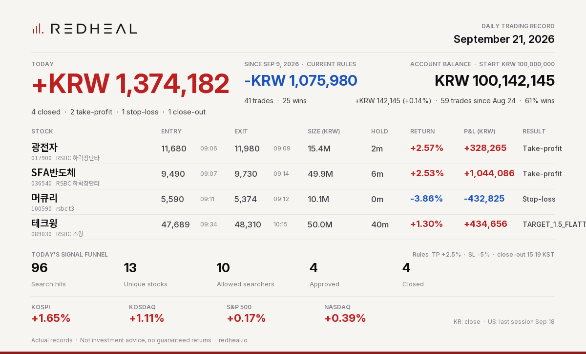

# REDHEAL Auto-Trading — Korea 2026-09-21



```text
REDHEAL Auto-Trading | Sep 21, 2026
Today +KRW 1,374,182 | 4 closed (TP 2/SL 1/EOD 1)
광전자 +KRW 328,265 (+2.57%) TP
SFA반도체 +KRW 1,044,086 (+2.53%) TP
머큐리 -KRW 432,825 (-3.86%) SL
테크윙 +KRW 434,656 (+1.30%) TARGET_1.5_FLATTEN
Not investment advice.
```

Posted on X: https://x.com/RedhealOfficial/status/2101935737486893375

Actual records. Not investment advice, no guaranteed returns. https://redheal.io
