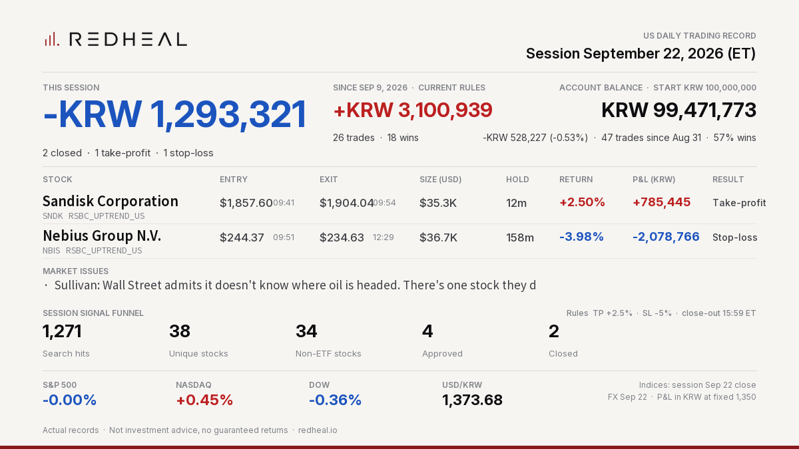

# REDHEAL Auto-Trading — US session 2026-09-22



```text
REDHEAL Auto-Trading US | Session Sep 22, 2026
Session -KRW 1,293,321 | 2 closed (TP 1/SL 1/EOD 0)
Sandisk Corporation SNDK +KRW 785,445 (+2.50%) TP
Nebius Group N.V. NBIS -KRW 2,078,766 (-3.98%) SL
Since Sep 9 (current rules) +KRW 3,100,939
Not investment advice.
```

Posted on X: https://x.com/RedhealOfficial/status/2102510777509036318

Actual records. Not investment advice, no guaranteed returns. https://redheal.io
