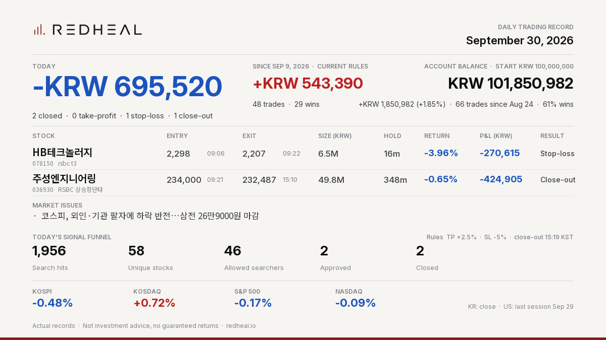

# REDHEAL Auto-Trading — Korea 2026-09-30



```text
REDHEAL Auto-Trading | Sep 30, 2026
Today -KRW 695,520 | 2 closed (TP 0/SL 1/EOD 1)
HB테크놀러지 -KRW 270,615 (-3.96%) SL
주성엔지니어링 -KRW 424,905 (-0.65%) EOD
Since Sep 9 (current rules) +KRW 543,390
Balance KRW 101,850,982 (+1.85% since Aug 24)
Not investment advice.
```

Posted on X: https://x.com/RedhealOfficial/status/2105197225089568909

Actual records. Not investment advice, no guaranteed returns. https://redheal.io
