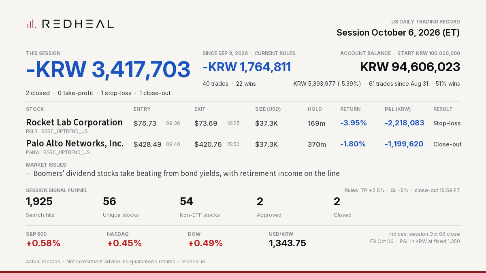

# REDHEAL Auto-Trading — US session 2026-10-06



```text
REDHEAL Auto-Trading US | Session Oct 06, 2026
Session -KRW 3,417,703 | 2 closed (TP 0/SL 1/EOD 1)
Rocket Lab Corporation RKLB -KRW 2,218,083 (-3.95%) SL
Palo Alto Networks, Inc. PANW -KRW 1,199,620 (-1.80%) EOD
Since Sep 9 (current rules) -KRW 1,764,811
Not investment advice.
```

Posted on X: https://x.com/RedhealOfficial/status/2107584214841635069

Actual records. Not investment advice, no guaranteed returns. https://redheal.io
